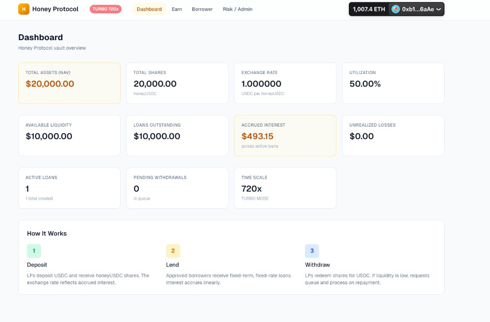
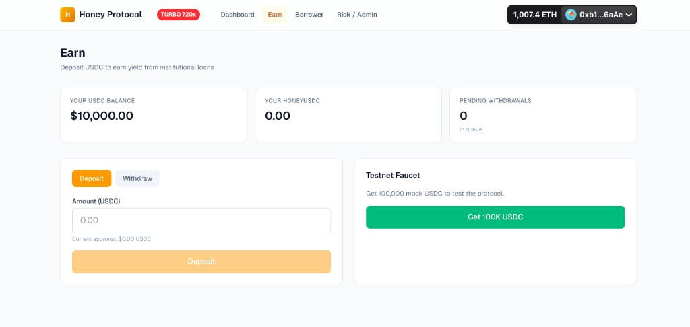
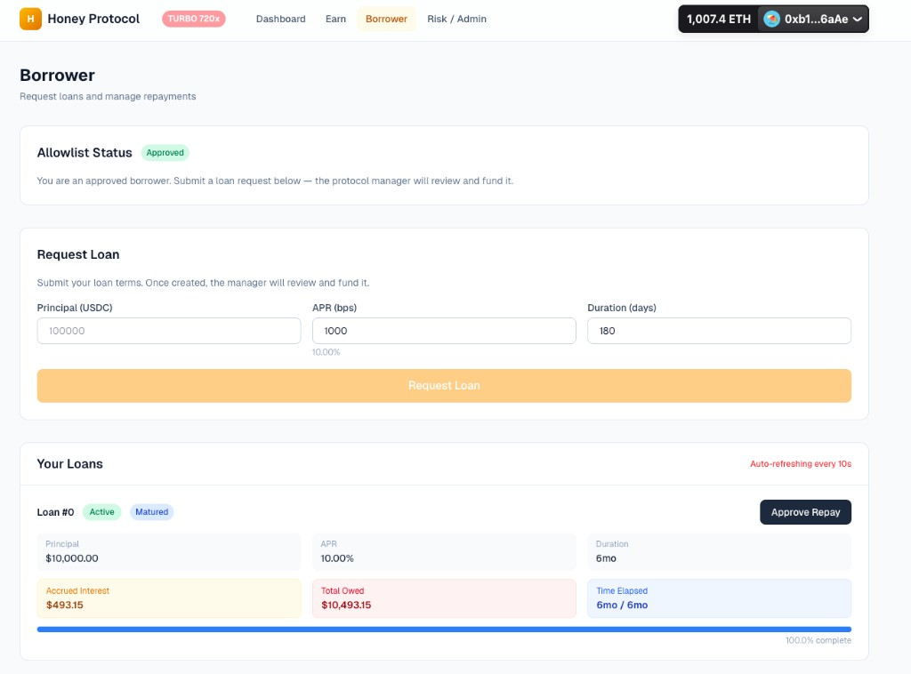
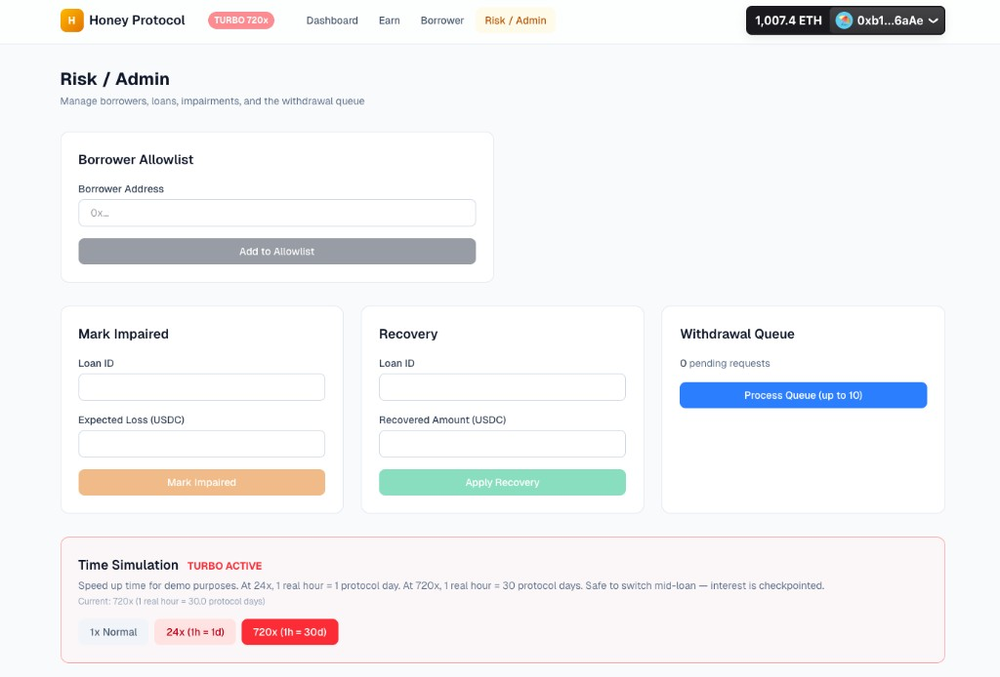

# Credit Protocol — Institutional Credit Vault

An on-chain credit facility built on ERC-4626. LPs deposit USDC into a vault, the manager extends fixed-term loans to allowlisted borrowers, and a withdrawal queue handles liquidity mismatches — all with full impairment and recovery accounting.

## Architecture

```
┌──────────────┐     ┌──────────────┐     ┌──────────────────┐
│   HoneyVault │────▶│  LoanManager │────▶│ WithdrawalQueue  │
│  (ERC-4626)  │     │              │     │                  │
│  honeyUSDC   │     │  allowlist   │     │  FIFO queue      │
│              │     │  fixed-term  │     │  best-effort     │
└──────────────┘     └──────────────┘     └──────────────────┘
       │                    │
       ▼                    ▼
┌──────────────┐     ┌──────────────┐
│   MockUSDC   │     │  Collateral  │
│   (6 dec)    │     │  (optional)  │
└──────────────┘     └──────────────┘
```

### Key Features

- **ERC-4626 Vault**: deposit/withdraw USDC, receive honeyUSDC shares
- **Institutional Credit**: borrower allowlist, manager-approved loans
- **Fixed-Term Loans**: linear interest accrual, fixed APR and duration
- **NAV Accounting**: `totalAssets = cash + loans - unrealizedLosses`
- **Impairment Flow**: mark impaired → declare default → partial recovery
- **Withdrawal Queue**: when liquidity is insufficient, withdrawals queue FIFO
- **Turbo Mode**: configurable time acceleration for demo simulations (1x–720x)

## Screenshots

### Dashboard


### Earn (LP)


### Borrower


### Risk / Admin


## Loan Lifecycle

```
Created ──▶ Active ──▶ Repaid
               │
               ├──▶ Impaired ──▶ Defaulted ──▶ (partial recovery)
               │                     ▲
               └─────────────────────┘
```

1. **Created** — Borrower (or manager) submits loan terms; awaiting funding
2. **Active** — Manager funds the loan; interest accrues linearly at fixed APR
3. **Repaid** — Borrower repays principal + accrued interest; collateral returned
4. **Impaired** — Manager marks expected loss; vault NAV adjusts immediately
5. **Defaulted** — Full write-off; manager can later trigger partial recovery

## Smart Contracts

| Contract | Description |
|---|---|
| `MockUSDC` | 6-decimal ERC-20 with faucet |
| `HoneyVault` | ERC-4626 vault, tracks loans and losses |
| `LoanManager` | Loan lifecycle: create → fund → accrue → repay/default |
| `WithdrawalQueue` | FIFO queue for pending withdrawals |

## Turbo Mode (Time Simulation)

Loan durations are typically 90–180 days, which is impractical for live demos.
The `LoanManager` has a **timeScale** multiplier that accelerates protocol time:

| Scale | Effect | 180-day loan completes in |
|-------|--------|---------------------------|
| 1x | Normal (default) | 180 real days |
| 24x | 1 real hour = 1 protocol day | 7.5 real hours |
| 720x | 1 real hour = 30 protocol days | 6 real hours |

**How it works:** A virtual clock tracks protocol time. Each time the manager calls
`setTimeScale(uint256)`, the contract checkpoints how much virtual time has elapsed
so far and applies the new scale only to time going forward. This means you can safely
switch scales mid-loan (e.g. 1x → 720x → 1x) without retroactively inflating or
deflating interest.

When active, the navbar shows a red pulsing **TURBO** badge with the current multiplier.

> **Note:** This is a demo/testnet feature. In production, `timeScale` would be removed or locked to 1.

## Frontend

Next.js app with wagmi/viem for wallet interaction. Four pages: Dashboard, Earn (LP deposits/withdrawals), Borrower (request & repay loans), and Admin/Risk (fund loans, manage impairments, turbo mode).

```bash
cd frontend
npm install
npm run dev
```

The app reads contract addresses from environment variables — see `frontend/.env.local` after deploying.

## Development

```bash
# Build
forge build

# Test
forge test -vvv

# Deploy (local anvil)
anvil &
PRIVATE_KEY=0xac0974bec39a17e36ba4a6b4d238ff944bacb478cbed5efcae784d7bf4f2ff80 \
  forge script script/Deploy.s.sol --rpc-url http://127.0.0.1:8545 --broadcast
```

---

## Deployment Guide (Sepolia & Base)

### Step 1 — Set up environment variables

```bash
cp .env.example .env
```

Edit `.env` and fill in your values:

```env
PRIVATE_KEY=0xYOUR_DEPLOYER_PRIVATE_KEY
SEPOLIA_RPC_URL=https://eth-sepolia.g.alchemy.com/v2/YOUR_KEY
BASE_RPC_URL=https://base-mainnet.g.alchemy.com/v2/YOUR_KEY
ETHERSCAN_API_KEY=YOUR_ETHERSCAN_V2_KEY
```

Then load the env file into your shell:

```bash
source .env
```

### Step 2 — Deploy to Sepolia

```bash
forge script script/Deploy.s.sol \
  --rpc-url sepolia \
  --broadcast \
  --verify \
  --etherscan-api-key $ETHERSCAN_API_KEY \
  -vvvv
```

This will:
1. Deploy all 4 contracts (MockUSDC, HoneyVault, LoanManager, WithdrawalQueue)
2. Wire `vault.setLoanManager(...)` automatically
3. Verify all contracts on Etherscan (Sepolia) in one go

### Step 3 — Deploy to Base

```bash
forge script script/Deploy.s.sol \
  --rpc-url base \
  --broadcast \
  --verify \
  --etherscan-api-key $ETHERSCAN_API_KEY \
  -vvvv
```

Same flow — deploys and verifies on BaseScan.

### Step 4 — Save deployed addresses

After each deploy, the console output will print the addresses. Copy them into
your frontend `.env.local`:

```bash
# frontend/.env.local
NEXT_PUBLIC_USDC_ADDRESS=0x...
NEXT_PUBLIC_VAULT_ADDRESS=0x...
NEXT_PUBLIC_LOAN_MANAGER_ADDRESS=0x...
NEXT_PUBLIC_WITHDRAWAL_QUEUE_ADDRESS=0x...
```

Also update the chain config in `frontend/src/lib/wagmi.ts` to point
at the correct chain (sepolia or base) instead of `foundry`.

### Verify a single contract manually (if needed)

If auto-verify fails or you want to re-verify later:

```bash
forge verify-contract <DEPLOYED_ADDRESS> src/HoneyVault.sol:HoneyVault \
  --chain sepolia \
  --etherscan-api-key $ETHERSCAN_API_KEY \
  --constructor-args $(cast abi-encode "constructor(address)" <USDC_ADDRESS>)
```

Replace `--chain sepolia` with `--chain base` for Base.

